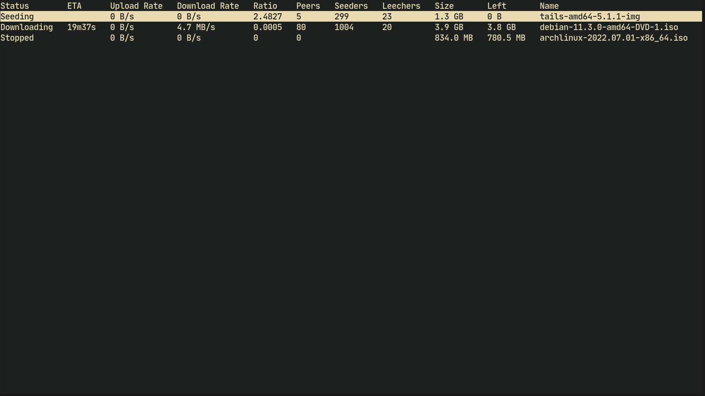
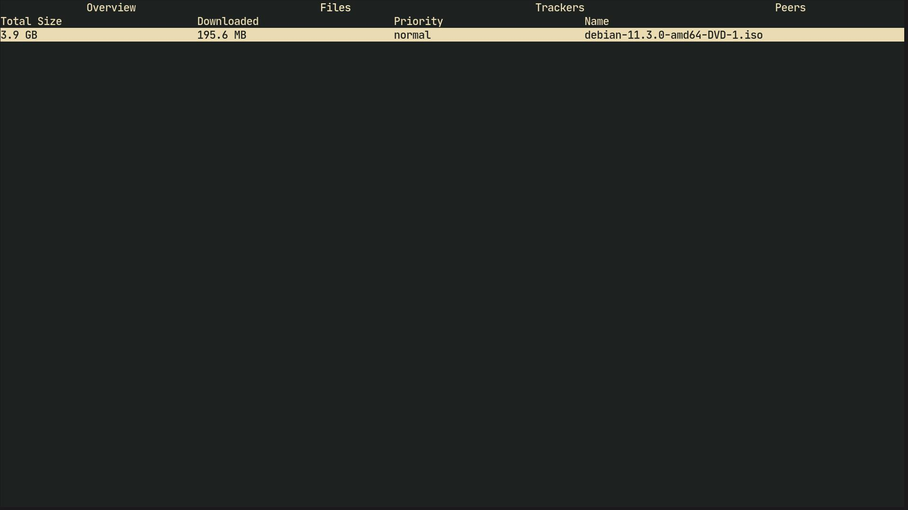

# Transmission Remote TUI (`trt`)

> A TUI for BitTorrent client transmission




## Installation

### Arch Linux

* `trt` is available in the `AUR` (packaged by the developer himself)

```bash
yay -S transmission-remote-tui-git
```

### From source

* Build dependencies: `go`

```bash
make && sudo make install clean
```

## Usage

* The actual binary is called `trt`
* Transmission daemon must be running

```bash
transmission-daemon &
```

* Remote `RPC` URL

```bash
trt --url http://203.12.65.10:9091/transmission/rpc
```

* Authenticate, if required

```bash
trt --username <username> --password <password>
```

* Version

```bash
trt --version
```

* Navigation

| keybinding | Action                                             |
|------------|----------------------------------------------------|
| h, j, k, l | move around                                        |
| g          | scroll to the top of the page                      |
| G          | scroll to the bottom of the page                   |
| q          | quit / go back                                     |
| Q          | kill the transmission daemon                       |
| l, enter   | show more details about a torrent                  |
| K          | move torrent up the queue                          |
| J          | move torrent down the queue                        |
| U          | move torrent at the top of the queue               |
| D          | move torrent at the bottom of the queue            |
| p          | pause/start torrent                                |
| r          | remove torrent                                     |
| R          | remove torrent and delete corresponding local data |
| v          | verify torrent                                     |
| t          | ask trackers for more peers                        |
| m          | copy magnet link to clipboard                      |

* Changing file's priority

| keybinding | Action                                      |
|------------|---------------------------------------------|
| i, d       | increase/decrease file priority             |
| o          | change priority of focused file to 'off'    |
| l          | change priority of focused file to 'low'    |
| n          | change priority of focused file to 'normal' |
| h          | change priority of focused file to 'high'   |
| O          | change priority of all files to 'off'       |
| L          | change priority of all files to 'low'       |
| N          | change priority of all files to 'normal'    |
| H          | change priority of all files to 'high'      |

## Uninstall

```bash
sudo make uninstall
```

## Further reading

* `trt` does not have the ability to read new torrent files/magnet links.
  Use [transmission-remote](https://linux.die.net/man/1/transmission-remote)
  for that.

* Adding `mimeapp` entry

```bash
# File: ~/.local/share/applications/torrent.desktop

[Desktop Entry]
Type=Application
Name=Torrent
Exec=/usr/bin/env transmission-remote -a %U
```

```bash
# File: ~/.config/mimeapps.list

[Default Applications]
x-scheme-handler/magnet=torrent.desktop;
application/x-bittorrent=torrent.desktop;
```
