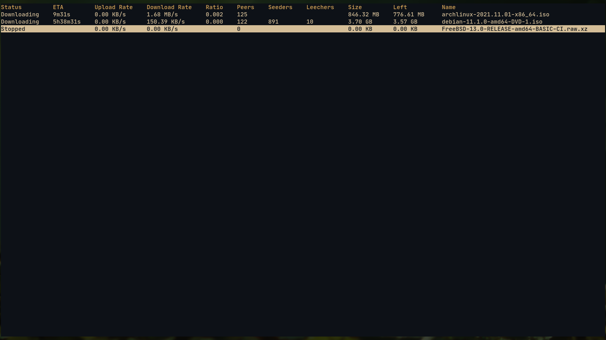
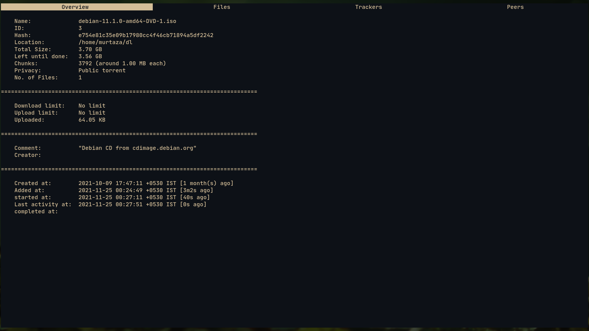
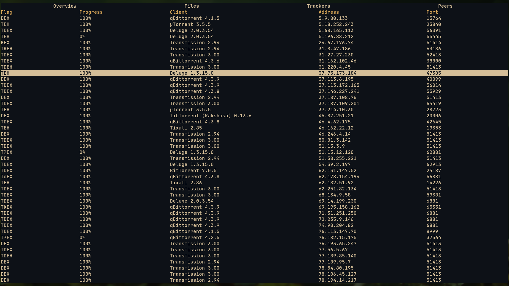

# Transmission Remote TUI (trt)
> A TUI for BitTorrent client transmission








## Installation
- Build dependencies: `go`

```bash
$ git clone https://github.com/Murtaza-Udaipurwala/transmission-remote-tui
$ cd transmission-remote-tui
$ make
$ sudo make clean install
```

## Usage
- The actual binary is called `trt`

- Transmission daemon must be running
```bash
$ transmission-daemon &
```

- In case you have changed the default transmission rpc port(9091), specify the new port
```bash
$ trt --port <new port>
```

- In case you enabled authentication, specify the username and password
```bash
$ trt --username <username> --password <password>
```

- Navigation

| keybinding | Action                                      |
|------------|---------------------------------------------|
| h, j, k, l | move around                                 |
| g          | scroll the to top of the page               |
| G          | scroll the to bottom of the page            |
| q          | quit / go back                              |
| Q          | kill the transmission daemon                |
| l, enter   | show more details about a torrent           |
| K          | move torrent up the queue                   |
| J          | move torrent down the queue                 |
| U          | move torrent at the top of the queue        |
| D          | move torrent at the bottom of the queue     |
| p          | pause/start torrent                         |
| r          | remove torrent                              |
| R          | remove torrent and delete all the files     |
| v          | verify torrent                              |
| t          | ask trackers for more peers                 |

- Changing file's priority

| keybinding | Action                                      |
|------------|---------------------------------------------|
| i, d       | increase/decrease file priority             |
| o          | change priority of focused file to 'off'    |
| l          | change priority of focused file to 'low'    |
| n          | change priority of focused file to 'normal' |
| h          | change priority of focused file to 'high'   |
| O          | change priority of all files to 'off'       |
| L          | change priority of all files to 'low'       |
| N          | change priority of all files to 'normal'    |
| H          | change priority of all files to 'high'      |

## Uninstalling
```bash
$ sudo make uninstall
```

## Further reading

### Setting up mimeapp entry
- `trt` does not have the ability to read/add torrent files/magnet
  links(however, it can be added rather easily). This is because you don't
  really need this feature.

- Simply create a mimeapp entry, telling it what to do when it finds a torrent file/magnet link
```bash
# File: ~/.config/mimeapps.list
# xdg-open will use these settings to determine how to open filetypes.

[Default Applications]

# These .desktop entries can also be seen and changed in ~/.local/share/applications/
x-scheme-handler/magnet=torrent.desktop;
application/x-bittorrent=torrent.desktop;
```

- Now we must create torrent.desktop file under `~/.local/share/applications/`
```bash
# File: ~/.local/share/applications/torrent.desktop

[Desktop Entry]
Type=Application
Name=Torrent
Exec=/usr/bin/env transadd %U
```

- `transadd` is a shell script in my `PATH`. This is the script that tells
  `transmission daemon` to add our torrent
```bash
#!/bin/sh

# Mimeapp script for adding torrent to transmission-daemon, but will also start
# the daemon first if not running.  transmission-daemon sometimes fails to take
# remote requests in its first moments, hence the sleep.

pidof transmission-daemon >/dev/null || transmission-daemon &
sleep 3
# notify-send "🔽 Adding Torrent"
exec transmission-remote -a "$@"
```

[Video tutorial on setting up mimeapp entry](https://odysee.com/@Luke:7/torrenting-setup-with-transmission:1)(the TUI program used is `transmission-remote-cli` instead of `trt`)


#### All pull requests are welcomed
#### Open issues for discussion/bug report
